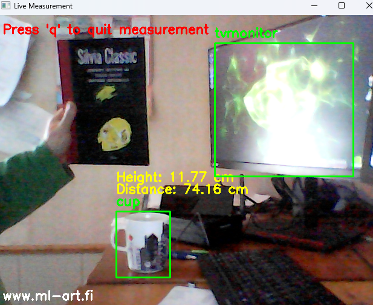

# Dynamic-Object-Measurement
Real-time dynamic object measurement using YOLOv4-tiny and OpenCV

# Dynamic Object Measurement

This project automatically detects objects from a reference image and allows real-time distance and height measurement using YOLOv4-tiny and OpenCV.
## Example

Here is an example of the live measurement in action:

## Features
- Automatic reference image capture
- Dynamic object detection (best match selected automatically)
- Real-time object measurement
- Works with any detectable object (person, bottle, chair, etc.)
- User-friendly interface with on-screen instructions
- Website watermark displayed: www.ml-art.fi

## Requirements
- Python 3
- OpenCV (`pip install opencv-python`)
- YOLOv4-tiny weights and config files
- `classes.txt` file (COCO class names)

## Usage
1. Run the script.
2. Follow the on-screen instructions.
3. Move into the camera view and wait 10 seconds.
4. Input real-world distance, height, and width of the detected object.
5. Live measurement starts automatically.
6. Press `q` to quit the live measurement.

---

Author: **Anssi Kuru**  
Website: [www.ml-art.fi](https://www.ml-art.fi/)
